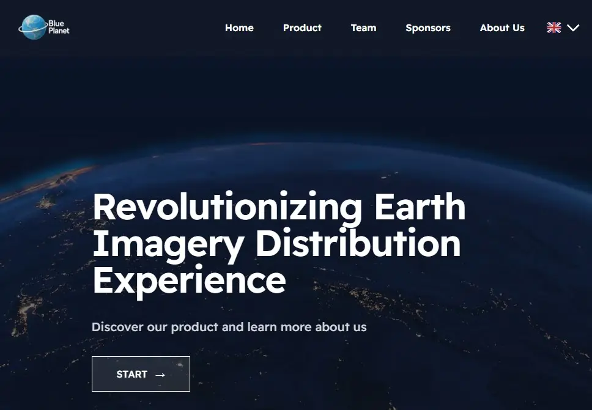

# 🌍 Blue Planet

**Blue Planet** is a technology initiative focused on democratizing access to high-resolution Earth observation through microsatellite constellations.



## 🛰️ About

This project showcases the mission, team, and technological vision of Blue Planet through a modern, multilingual, responsive website.

Built with [Astro](https://astro.build/), [Tailwind CSS](https://tailwindcss.com/), and fully deployed on [Vercel](https://vercel.com/).

---

## 🔗 Live site

👉 [https://blueplanet-tau.vercel.app](https://blueplanet-tau.vercel.app)

---

## 🌐 Supported languages

- 🇬🇧 English (`/en`)
- 🇪🇸 Español (`/es`)
- 🇫🇷 Français (`/fr`)

Default language: English (redirects from `/` → `/en`)

---

## ⚙️ Tech stack

- **Framework**: Astro
- **Styling**: Tailwind CSS
- **Animations**: AOS (Animate on Scroll)
- **Hosting**: Vercel
- **Multilingual support**: Custom i18n logic with static path generation

---

## 🚀 Getting started

```bash
# Clone the repo
git clone https://github.com/your-org/blueplanet.git
cd blueplanet

# Install dependencies
npm install

# Run locally
npm run dev
```
